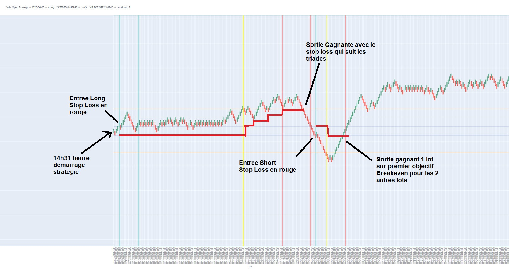

# Vola-Open-NN
    Neural Network for supervised Vola Open WL Strategy

<!-- vscode-markdown-toc -->
* 1. [Forewords](#Forewords)
* 2. [Benchmark](#Benchmark)
* 3. [Content](#Content)
* 4. [Prerequisites](#Prerequisites)
* 5. [Installing](#Installing)
* 6. [Project structure](#Projectstructure)
* 7. [Workflow](#Workflow)
* 8. [Setup for production server](#Setupforproductionserver)
* 9. [GPU config](#GPUconfig)
* 10. [Unit test](#Unittest)
* 11. [TODO](#TODO)
* 12. [Authors & contributions](#Authorscontributions)

<!-- vscode-markdown-toc-config
	numbering=true
	autoSave=true
	/vscode-markdown-toc-config -->
<!-- /vscode-markdown-toc -->

##  1. Forewords
This project is based on the existing work of professionnal trader Wim Lievens who has more than 20 years of experience and who established the successful movement-based Wim Lievens chart (read more on https://www.whselfinvest.com/en-lu/trading-platform/trader-tools/technical-analysis/12-wim-lievens-bars?whref=best-trading-platforms.com). In simple words, the strategy (known as Volatility Open) is based on range break-outs that happen daily. For this project we've used TickWrite's Stock Index (up to 18 symbols were used in the process and 11 turned out to be more successful). The purpose of the project is to add a supervision layer to an existing and functionning human-based trading strategy. By supervision, we mean predicting the success/failure behavior of the strategy on a given day for a given symbol. This doesn't only prevent risky trades but also optimizes the gain through proper money management.

##  2. Benchmark
The recorded benchmark results on the 16/05/2020 indicates a 60.3% success rate on a total of 18 symbols in a period of 271 days (meaning a total training size of 4878). 

The recorded benchmark results on the 06/06/2020 (current version) indicates a 69.8% success rate on a total of 18 symbols in a period of 291 days (meaning a total training size of 5238). 

##  3. Content
This project contains : 
- the main code that runs daily
- a simulator of a real time trading environnement with visual WL charts

- a indicators calculation engine with standard financial indicators
- a plotting toolkit for data visualization and analysis (used during features selection)
- a sandbox for Neural Network hyperparameters tuning, gridCV runs and benchmarking

##  4. Prerequisites
    Python 3.8.3
    Tensorflow 2.1
    Keras 2.3.1

##  5. Installing
    Clone repository
    Add data subfolder to project (please contact the owner for data subfolder)

##  6. Project structure
Please refer to `structure.docx` file for directory tree

##  7. Workflow
Please refer to corresponding subdirectory

##  8. Setup for production server
!!! IMPORTANT !!!

This project requires TickData (either TickWrite or TickWriteWeb) to be setup to run, please contact the owner of the project to obtain access.

Important setups include :
1) install TickWrite client
2) creating a TickWrite schedule daily on week days that runs 2 separate TickWrite jobs:
    - one for tick data fetch, refresh new data for network training
    - one for time data fetch, required for next day success forecast
3) On Windows, create task that runs SCHEDULE.PY using Task Scheduler, please refer to this tutorial
    https://www.youtube.com/watch?v=n2Cr_YRQk7o @Cedric Yarish

##  9. GPU config
To run on GPU using annaconda :
    First run :
        conda create -n tf-gpu tensorflow-gpu
    Activate :
        conda activate tf-gpu

##  10. Unit test
    python TEST.py

##  11. TODO
 - improve money management strategy
 - feature selections : pairwise correlation, multicollinearity, correlation with target, cluster analysis, forward selection, backward elimination, stepwise selection, LASSO, logistic regression, Tree-based selection
 - extend usage to other trading strategies as a toolbox

##  12. Authors & contributions
- Alexandre Bremard - Project Developper
- Philippe Bremard - Trading Expert
- Wim Lievens - Trading Expert